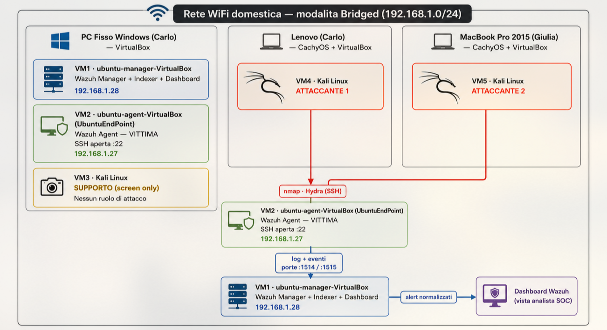

# Homelab SIEM con Wazuh

> Laboratorio di sicurezza difensiva (Blue Team / SOC): deployment di un SIEM, simulazione di attacchi in ambiente controllato e analisi della detection.

**Autori:** Carlo Alessio e Giulia Mangraviti
**Ambiente:** rete domestica isolata — 3 host fisici, 5 macchine virtuali (VirtualBox)
**Stack:** Wazuh (Manager + Indexer + Dashboard) · Ubuntu 24.04 · Kali Linux · VirtualBox

---

## Di cosa si tratta

Abbiamo progettato e realizzato un laboratorio SIEM completo per acquisire competenze pratiche di **detection**, **log management** e **incident analysis** — il cuore del lavoro di un SOC Analyst di Tier 1.

Un server Wazuh raccoglie e correla i log di una macchina vittima (Wazuh Agent), che viene attaccata da due host indipendenti con Kali Linux. Ogni evento generato dagli attacchi — scansioni di rete, brute force SSH, escalation di privilegi, comandi eseguiti da root — viene rilevato, normalizzato e visualizzato sulla dashboard sotto forma di alert. In parallelo, il modulo di Vulnerability Detection mappa le vulnerabilità note dell'endpoint.

**Il progetto è partito da un'architettura sbagliata**, che è stata diagnosticata, corretta e ricostruita. Proprio la gestione degli errori — RAM insufficiente e connettività di rete tra le VM — è la parte più formativa del lavoro, ed è documentata per intero: vedi [Problemi e soluzioni](docs/06-problemi-soluzioni.md).

---

## Obiettivi

- Distribuire uno stack SIEM funzionante (Wazuh all-in-one) sulla nostra rete di casa isolata.
- Registrare correttamente un agente ed effettuare l'enrollment Agent → Manager.
- Generare telemetria realistica tramite attacchi da host separati.
- Configurare la detection lato difensivo: audit dei comandi privilegiati (`sudo`), autenticazioni (PAM/SSH), brute force, scansioni e vulnerability detection.
- Costruire una **base comune** da cui ciascuno ha condotto in autonomia il proprio attacco dalla propria macchina Kali, per confrontare la detection da due sorgenti diverse.
- Lavorare seguendo la [documentazione ufficiale Wazuh](https://documentation.wazuh.com/current/) (Proof of Concept guide), per garantire configurazioni corrette e dimostrare la capacità di leggere e applicare documentazione tecnica.

---

## Architettura

**Come leggerla:** i due Kali attaccano entrambi la stessa vittima (Wazuh Agent). La vittima invia i suoi log al Wazuh Manager, che li correla e li mostra come alert sulla Dashboard. Avere due attaccanti distinti ci ha permesso di vedere la detection da **due IP sorgente diversi** — un esercizio di correlazione multi-sorgente.

> **Perché Windows come host del SIEM.** Wazuh è molto esigente in termini di RAM (Manager + Indexer basato su OpenSearch + Dashboard). Il PC fisso è l'unica macchina con risorse sufficienti a ospitare contemporaneamente due VM Ubuntu; i laptop restano dedicati alle VM Kali, molto più leggere.

---

## Indice della documentazione

| # | Documento | Contenuto |
|---|---|---|
| 00 | [Cronologia del progetto](docs/00-timeline.md) | Le fasi del lavoro in ordine, dall'ipotesi iniziale al report |
| 01 | [Inventario dell'ambiente](docs/01-inventario-ambiente.md) | Host fisici, VM, ruoli, indirizzamento |
| 02 | [Deployment e enrollment](docs/02-deployment.md) | Installazione stack Wazuh, registrazione dell'agente |
| 03 | [Fase di attacco](docs/03-attacchi.md) | Ricognizione `nmap`, brute force SSH con `Hydra` |
| 04 | [Detection engineering](docs/04-detection.md) | Audit dei comandi privilegiati, autenticazioni PAM |
| 05 | [Vulnerability Detection](docs/05-vulnerability.md) | Inventario CVE dell'endpoint |
| 06 | [Problemi e soluzioni](docs/06-problemi-soluzioni.md) | **Cosa è andato storto e come l'abbiamo diagnosticato** |
| 07 | [Riferimenti](docs/07-riferimenti.md) | Documentazione ufficiale seguita |

---

## Risultati e telemetria osservata

Al termine il laboratorio produceva, **in modo ripetibile**, alert e dati per:

| Attività | Evidenza raccolta |
|---|---|
| **Ricognizione** (`nmap`) | Scansioni da due IP sorgente distinti — unica porta esposta `22/SSH` (OpenSSH 9.6p1), 65534 porte filtrate |
| **Brute force SSH** (`Hydra`) | Rule ID **2502** — *User missed the password more than one time* (liv. 10) e **5710** — *Attempt to login using a non-existent user* |
| **Escalation di privilegi** | Rule ID **5404** — *Three failed attempts to run sudo* (liv. 10) e **5402** — *Successful sudo to ROOT executed*, con sessioni PAM 5501/5502/5503 |
| **Audit del comando** | Campo `data.command` con il comando esatto eseguito da root, utente sorgente/destinazione, TTY |
| **Vulnerability Detection** | 2.225 vulnerabilità sull'agente: 83 Critical · 836 High · 1.031 Medium · 72 Low · 203 pending |

Il flusso SOC completo che ne risulta:

**attacco → generazione log sulla vittima → invio all'agente → correlazione sul Manager → alert sulla dashboard → analisi**

affiancato dalla gestione delle vulnerabilità dell'endpoint.

> Nota metodologica: nel test con Hydra **nessuna password valida è stata trovata**. Dal punto di vista difensivo ciò che conta è che la detection ha funzionato — *exploit non riuscito, detection riuscita* è esattamente l'obiettivo di un lab SOC.

---

## Problemi riscontrati (sintesi)

| # | Problema | Causa | Soluzione | Lezione |
|---|---|---|---|---|
| 1 | I laptop non reggevano il carico | Wazuh/Indexer affamato di RAM | Manager + Agent spostati sul PC fisso; Kali sui laptop | Dimensionare le risorse **prima** del deployment |
| 2 | Agente non visibile sulla dashboard | Entrambe le VM in NAT → reti isolate | Passaggio a scheda bridged su entrambe | NAT isola le VM; bridged le mette sulla stessa LAN |
| 3 | Agente ancora disconnesso dopo il bridge | `ossec.conf` dell'agente puntava al vecchio IP NAT | Aggiornato l'indirizzo del Manager + restart del servizio | Se cambia l'IP del Manager, aggiorna sempre l'agente |
| 4 | Nessuna porta da attaccare | Vittima con servizi minimi | Abilitato SSH (`:22`) manualmente | Serve una superficie d'attacco per generare telemetria |

Il dettaglio completo di ogni diagnosi è in → [docs/06-problemi-soluzioni.md](docs/06-problemi-soluzioni.md)

---

## Evidenze

| Fig. | Contenuto |
|---|---|
| [1](img/fig1-nmap.png) | Ricognizione `nmap` dal Kali attaccante |
| [2](img/fig2-hydra.png) | Brute force SSH con Hydra + alert 2502 / 5710 |
| [3](img/fig3-sudo-fail.png) | Escalation privilegi fallita — rule 5404 / 5503 |
| [4](img/fig4-sudo-ok.png) | Escalation riuscita e sessione PAM — rule 5402 |
| [5](img/fig5-command-audit.png) | Audit del comando: dettaglio evento `data.command` |
| [6](img/fig6-vuln-dashboard.png) | Vulnerability Detection — dashboard di sintesi |
| [7](img/fig7-vuln-inventory.png) | Vulnerability Detection — inventario CVE |
| [8](img/fig8-vuln-events.png) | Vulnerability Detection — eventi Active |

Le immagini complete con didascalia sono incorporate nei rispettivi documenti in `docs/`.

---

## Modalità di lavoro

Il progetto è stato realizzato **a quattro mani, in modalità collaborativa e simmetrica**: mentre uno eseguiva un passaggio, l'altro lo replicava in parallelo sul proprio host, per poi invertire i ruoli. Questo vale sia per la costruzione dell'infrastruttura sia per la fase di attacco.

- **Costruzione condivisa** — progettazione dell'architettura, provisioning delle VM, deployment dello stack, enrollment dell'agente e troubleshooting della rete (NAT → bridged, fix dell'`ossec.conf`) sono stati affrontati insieme, con entrambi che ripercorrevano ogni step.
- **Attacchi replicati su due host indipendenti** — ogni vettore (`nmap`, `Hydra`) è stato eseguito da entrambi dalla propria VM Kali: Carlo dal Lenovo, Giulia dal MacBook.

Ne consegue che **entrambi padroneggiano l'intera catena**, dal deployment all'attacco.

---

## Lezioni apprese

- Il **dimensionamento hardware** (soprattutto la RAM per l'Indexer) è un vincolo di progetto reale.
- La **rete delle VM** è la fonte di problemi numero uno in un homelab: capire NAT vs bridged vs host-only è fondamentale.
- La comunicazione **Agent → Manager** dipende da tre cose insieme: rete condivisa, porte raggiungibili, indirizzo del Manager corretto nell'agente.
- Un buon laboratorio difensivo non serve solo ad "attaccare": il valore è nel **configurare la detection** e nella gestione delle vulnerabilità, leggendo gli alert come farebbe un analista.

---

## Nota etica

Tutti i test sono stati eseguiti su una **rete privata e isolata**, su **macchine di nostra proprietà**, a scopo di apprendimento difensivo, seguendo le guide Proof of Concept ufficiali di Wazuh. Nessun sistema di terzi è stato coinvolto.

---
